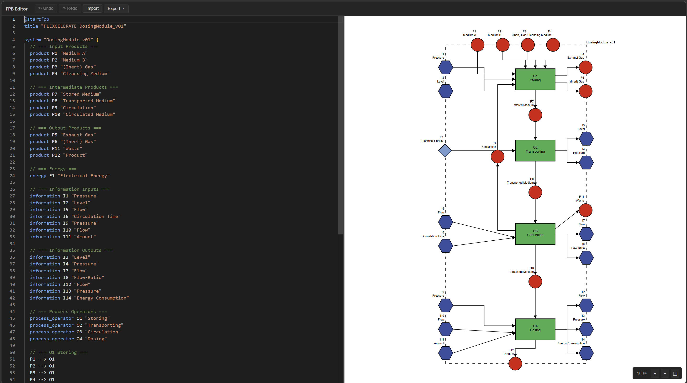

# Text-Based FPB Editor

[](LICENSE)

A text-based editor for creating **VDI 3682 Formalized Process Descriptions** (FPB diagrams) using a PlantUML-inspired syntax. Write FPB code on the left, see the rendered SVG diagram on the right — in real time.



## Getting Started

### Prerequisites

- Python 3.10+ with pip
- Node.js 18+ with npm

### Backend

```bash
cd backend
pip install -r requirements.txt
uvicorn main:app --host 0.0.0.0 --port 8000 --reload
```

### Frontend

```bash
cd frontend
npm install
npm run dev
```

Open http://localhost:5173 in your browser. The frontend proxies API requests to the backend at port 8000.

## Usage

| Panel | Function |
|-------|----------|
| **Left** | Monaco text editor — write FPB code here |
| **Right** | Live SVG diagram preview |
| **Toolbar** | Export (XML, PDF, Text) and import FPB files |

The diagram updates automatically as you type.

## FPB Syntax Reference

### Document Structure

```
@startfpb
title "Process Name"

// your elements and connections here

@endfpb
```

- `@startfpb` / `@endfpb` — required document delimiters
- `title "Name"` — set the process name
- `// text` — comment (ignored by parser)

### Element Keywords

Syntax: `keyword <id> "optional label"`

| Keyword | Category | Description |
|---------|----------|-------------|
| `product` | State | Material or good |
| `energy` | State | Energy element |
| `information` | State | Data or control signal |
| `process_operator` | Process | Operation or transformation |
| `technical_resource` | Resource | Machine or equipment |

### Connection Operators

| Operator | Type | Valid Between |
|----------|------|---------------|
| `-->` | Flow | State ↔ ProcessOperator |
| `-.->` | Alternative Flow | State ↔ ProcessOperator |
| `==>` | Parallel Flow | State ↔ ProcessOperator |
| `<..>` | Usage | ProcessOperator ↔ TechnicalResource |

## Example

```fpb
@startfpb
title "My Process"

// Declare elements
product P1 "Input Material"
product P2 "Output Product"
energy E1 "Electrical Power"
process_operator PO1 "Processing"
technical_resource TR1 "Machine"

// Connections
P1 --> PO1
E1 --> PO1
PO1 --> P2
PO1 <..> TR1

@endfpb
```

**Rendered output:** The diagram shows a VDI 3682 process view with **P1** (Input Material) and **E1** (Electrical Power) flowing into process operator **PO1** (Processing), which outputs **P2** (Output Product). **TR1** (Machine) is linked to PO1 via a usage connection. States appear as rounded shapes, the process operator as a rectangle, and the technical resource below the process connected by a dotted line.

## VDI 3682 Connection Rules

1. **Flow / Alternative Flow / Parallel Flow** (`-->`, `-.->`, `==>`) — only between **States** (product, energy, information) and **Process Operators**
2. **Usage** (`<..>`) — only between **Process Operators** and **Technical Resources**
3. Direct connections between elements of the same category are **not allowed** (e.g., product → product or process → process)

## Project Structure

```
├── backend/          Python FastAPI backend (parser, layout, export)
├── frontend/         React + TypeScript web UI (Monaco editor, SVG diagram)
├── examples/         Example .fpb files
└── docs/             Documentation and diagrams
```

## Export Formats

- **VDI 3682 XML** — Compatible with [HSU Hamburg FPD_Schema.xsd](https://github.com/hsu-aut/IndustrialStandard-XSD-VDI3682)
- **PDF** — Document export with diagram rendering
- **FPB Text** — Re-export the text representation

## Running Tests

```bash
# Backend tests
cd backend
pip install -r requirements-dev.txt
pytest tests/ -v

# Frontend build check
cd frontend
npm run build
```

## Roadmap

- **Shared TypeScript Layout Package** — Extract the layout algorithm into a reusable npm package for use by both the web frontend and future VS Code extension
- **Browser-based SVG/PNG Export** — Export diagrams directly from the rendered frontend SVG
- **TypeScript Parser** — Port the Python parser to TypeScript to enable fully client-side operation

## Contributing

Contributions are welcome! Please open an issue to discuss your idea before submitting a pull request.

## License

This project is licensed under the [MIT License](LICENSE).

See [THIRD-PARTY-LICENSES.md](THIRD-PARTY-LICENSES.md) for dependency license attributions.
