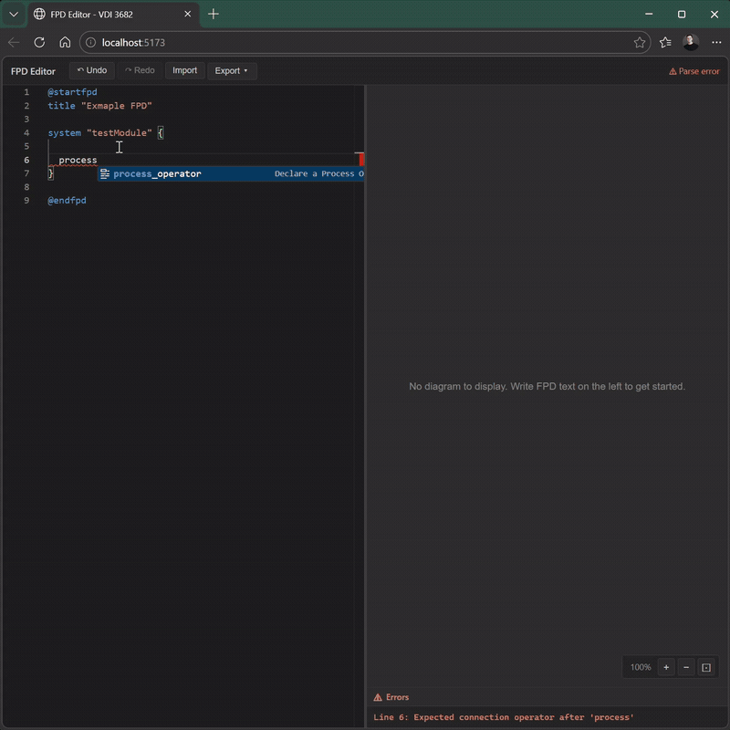

# Text-Based FPD Editor

[](LICENSE)
[](https://www.typescriptlang.org/)
[](https://www.vdi.de/mitgliedschaft/vdi-richtlinien/details/vdivde-3682-blatt-1-formalisierte-prozessbeschreibungen-konzept-und-grafische-darstellung)

A text-based editor for creating **VDI 3682 Formalized Process Descriptions** (FPD diagrams) using a PlantUML-inspired syntax. Write FPD code on the left, see the rendered SVG diagram on the right — in real time.

[](#demo)

> **Built and maintained by [FLEXCELERATE Solutions GmbH](https://www.flexcelerate-solutions.com)** — a Dresden-based engineering company specializing in modular process automation (MTP per VDI/VDE/NAMUR 2658 / PNO MTP, modularization per VDI 2776) for the chemical and pharmaceutical industries. FLEXCELERATE uses the fpd-editor internally for MTP development and modularization projects and provides it as open source to support the adoption of VDI 3682 across the process industry.

---

## Why This Tool Exists

[VDI 3682](https://www.vdi.de/mitgliedschaft/vdi-richtlinien/details/vdivde-3682-blatt-1-formalisierte-prozessbeschreibungen-konzept-und-grafische-darstellung) defines a standardized way to describe processes as directed graphs of **process operators**, **states** (products, energy, information), and **technical resources**. Formalized Process Descriptions (FPDs) provide an unambiguous, tool-independent representation of process functionality — a prerequisite for modular plant engineering per [VDI 2776](https://www.vdi.de/richtlinien/details/vdi-2776-blatt-1-verfahrenstechnische-anlagen-modulare-anlagen-grundlagen-und-planung-modularer-anlagen) and for developing Module Type Packages (MTP) per [VDI/VDE/NAMUR 2658](https://www.vdi.de/richtlinien/details/vdivde-2658-blatt-1-automatisierungstechnisches-engineering-modularer-anlagen-in-der-prozessindustrie-allgemeines-konzept-und-schnittstellen) / [PNO MTP](https://www.profibus.de/mtp-module-type-package).

In practice, FPDs serve as the bridge between process engineering and automation engineering: they capture _what_ a process module does (its functional description) before defining _how_ it is automated (the MTP interface). This makes VDI 3682 a foundational standard in the modular automation ecosystem alongside ISA-88 procedural models.

Until now, there has been no dedicated, freely available tool for creating VDI 3682 diagrams. The fpd-editor fills this gap: type a text description, get a standards-compliant diagram instantly — without proprietary software or complex CAE suites.

### Use Cases

- **Process engineering teams** documenting modular plant designs per VDI 2776
- **Automation engineers** creating FPDs as input for MTP development (VDI/VDE/NAMUR 2658)
- **ISA-88 recipe engineers** visualizing batch process structures before implementation
- **Researchers and students** learning VDI 3682 formalized process descriptions

---

## Project Structure

```
fpd-editor/
├── packages/
│   ├── core/               @fpd-editor/core — shared parser, layout, renderer, exporters
│   ├── backend/            @fpd-editor/backend — Fastify REST API
│   ├── frontend/           React + Vite web UI (Monaco editor, SVG diagram)
│   └── vscode-extension/   VS Code extension with language support + preview
├── tooling/
│   ├── tsconfig/           Shared TypeScript configs
│   ├── eslint-config/      Shared ESLint config
│   └── prettier-config/    Shared Prettier config
├── schemas/                VDI 3682 XSD schema (git submodule)
├── docs/
│   ├── architecture/       Architecture Decision Records (ADRs)
│   └── examples/           Example .fpd files
└── media/                  Screenshots and icons
```

## Getting Started

### Prerequisites

- Node.js 20+
- [pnpm](https://pnpm.io/) 10+

### Install & Build

```bash
pnpm install
pnpm turbo build
```

### Development

```bash
# Start backend + frontend in parallel
pnpm turbo dev

# Or individually:
cd packages/backend && pnpm dev     # Fastify API on http://localhost:8741
cd packages/frontend && pnpm dev    # Vite dev server on http://localhost:5173
```

The frontend proxies API requests to the backend at port 8741.

### Testing & Linting

```bash
pnpm turbo test       # Run all unit tests
pnpm test:e2e         # Run end-to-end tests (Playwright, requires Chromium)
pnpm turbo lint       # Lint all packages
pnpm format:check     # Check formatting
```

The E2E tests start the dev servers automatically, open a headless Chromium browser, and verify the full user workflow (editing, diagram rendering, export, import, undo/redo, zoom). To run them with a visible browser for debugging:

```bash
pnpm test:e2e --headed
```

> On first run, install the Playwright browser with `npx playwright install chromium`.

## VS Code Extension

The FPD VS Code extension provides syntax highlighting, IntelliSense, diagnostics, and a live diagram preview — all without requiring the backend server.

**Install from Marketplace:**
Search for "FPD" in the VS Code Extensions panel, or visit the [Visual Studio Marketplace](https://marketplace.visualstudio.com/publishers/FLEXCELERATE).

See [packages/vscode-extension/README.md](packages/vscode-extension/README.md) for details.

### Building & Publishing the Extension

```bash
# 1. Build core (dependency of the extension)
pnpm turbo build --filter=@fpd-editor/core

# 2. Package as .vsix
cd packages/vscode-extension
npx vsce package --no-dependencies

# 3. Publish to Marketplace (requires PAT with Marketplace Manage scope)
npx vsce login FLEXCELERATE
npx vsce publish --no-dependencies
```

> `--no-dependencies` is required because `vsce` uses `npm` internally, which doesn't resolve pnpm workspace dependencies.

## Usage

| Panel       | Function                                               |
| ----------- | ------------------------------------------------------ |
| **Left**    | Monaco text editor — write FPD code here               |
| **Right**   | Live SVG diagram preview                               |
| **Toolbar** | Export (XML, PDF, SVG, PNG, Text) and import FPD files |

The diagram updates automatically as you type.

## FPD Syntax Reference

### Document Structure

```
@startfpd
title "Process Name"

// your elements and connections here

@endfpd
```

- `@startfpd` / `@endfpd` — required document delimiters
- `title "Name"` — set the process name
- `system "Name" { ... }` — group elements inside a system boundary (VDI 3682 system limit)
- `// text` — comment (ignored by parser)

### Element Keywords

Syntax: `keyword <id> "optional label"`

| Keyword              | Category | Description                 |
| -------------------- | -------- | --------------------------- |
| `product`            | State    | Material or good            |
| `energy`             | State    | Energy element              |
| `information`        | State    | Data or control signal      |
| `process_operator`   | Process  | Operation or transformation |
| `technical_resource` | Resource | Machine or equipment        |

### Placement Annotations

State elements (product, energy, information) can carry an optional placement annotation that controls where they appear relative to the system boundary in the rendered diagram:

| Annotation         | Position                                   |
| ------------------ | ------------------------------------------ |
| `@boundary`        | On the system boundary (default direction) |
| `@boundary-top`    | Top edge of the system boundary            |
| `@boundary-bottom` | Bottom edge of the system boundary         |
| `@boundary-left`   | Left edge of the system boundary           |
| `@boundary-right`  | Right edge of the system boundary          |
| `@internal`        | Inside the system boundary                 |

Usage: `product P1 "Label" @boundary-left`

### Connection Operators

| Operator | Type             | Valid Between                         |
| -------- | ---------------- | ------------------------------------- |
| `-->`    | Flow             | State <-> ProcessOperator             |
| `-.->`   | Alternative Flow | State <-> ProcessOperator             |
| `==>`    | Parallel Flow    | State <-> ProcessOperator             |
| `<..>`   | Usage            | ProcessOperator <-> TechnicalResource |

## Examples

### Basic Example: Reactor Module

```fpd
@startfpd
title "Reactor Module"

// Declare elements
product P1 "Catalyst Solution"
product P2 "Reactor Product"
energy E1 "Thermal Energy"
information I1 "Temperature"
process_operator PO1 "Reacting"
technical_resource TR1 "Stirred Tank Reactor"

// Connections
P1 --> PO1
E1 --> PO1
I1 --> PO1
PO1 --> P2
PO1 <..> TR1

@endfpd
```

### Industry Example: FLEXCELERATE DosingModule_v01

The following excerpt is based on FLEXCELERATE's DosingModule_v01 — a dosing module FPD from a modular pharmaceutical production project. The full example is available in [docs/examples/dosing-module.fpd](docs/examples/dosing-module.fpd).

```fpd
@startfpd
title "DosingModule_v01"

// Input Products
product P1 "Medium A"
product P2 "Medium B"
product P3 "(Inert) Gas"
product P4 "Cleansing Medium"

// Output Products
product P5 "Exhaust Gas"
product P12 "Product"

// Energy
energy E1 "Electrical Energy"

// Information
information I1 "Pressure"
information I2 "Level"
information I5 "Flow"

// Process Operators
process_operator O1 "Storing"
process_operator O2 "Transporting"
process_operator O3 "Circulation"
process_operator O4 "Dosing"

// Connections (excerpt)
P1 --> O1
P2 --> O1
P3 --> O1
P4 --> O1
I1 --> O1
I2 --> O1
O1 --> P5
E1 --> O2
I5 --> O3
O4 --> P12

@endfpd
```

This example demonstrates a typical modular process module as used in pharmaceutical dosing applications: multiple input media are stored, transported, circulated, and dosed — each step represented as a distinct process operator with its associated products, energy, and information flows per VDI 3682.

## VDI 3682 Connection Rules

1. **Flow / Alternative Flow / Parallel Flow** (`-->`, `-.->`, `==>`) — only between **States** (product, energy, information) and **Process Operators**
2. **Usage** (`<..>`) — only between **Process Operators** and **Technical Resources**
3. Direct connections between elements of the same category are **not allowed** (e.g., product -> product or process -> process)

## Export Formats

- **VDI 3682 XML** — Compatible with [HSU Hamburg FPD_Schema.xsd](https://github.com/hsu-aut/IndustrialStandard-XSD-VDI3682)
- **PDF** — Document export with diagram rendering
- **SVG** — Scalable vector graphic of the diagram
- **PNG** — Raster image of the diagram
- **FPD Text** — Re-export the text representation

## Contributing

Contributions are welcome! Please open an issue to discuss your idea before submitting a pull request.

## About FLEXCELERATE

[FLEXCELERATE Solutions GmbH](https://www.flexcelerate-solutions.com) is an engineering company in Dresden, Germany, specializing in modular process automation for the chemical and pharmaceutical industries. Our core competencies include:

- **MTP development** per VDI/VDE/NAMUR 2658 on 5+ automation platforms
- **ISA-88 recipe engineering** and process orchestration
- **VDI 3682** formalized process descriptions (this tool!)
- **Simulation** and virtual commissioning
- **Modularization consulting** per VDI 2776

FLEXCELERATE is active in NAMUR working groups, ISA 88 and the VDI/VDE/GMA.

**Get in touch:** [info@flexcelerate-solutions.com](mailto:info@flexcelerate-solutions.com) · [Book a consultation](https://www.flexcelerate-solutions.com/en/kontakt) · [LinkedIn](https://www.linkedin.com/company/flexcelerate-solutions)

## License

This project is licensed under the [MIT License](LICENSE).

See [THIRD-PARTY-LICENSES.md](THIRD-PARTY-LICENSES.md) for dependency license attributions.
