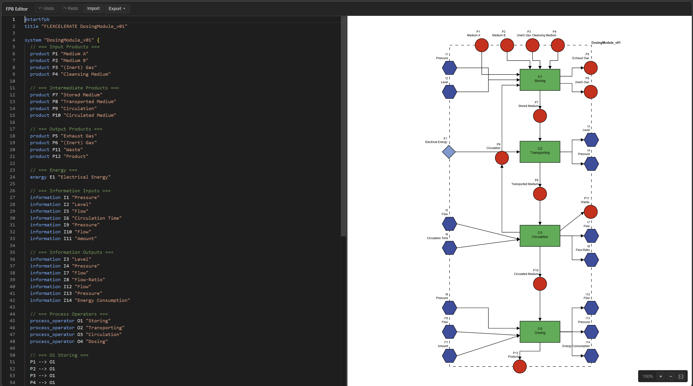

# Text-Based FPD Editor

[](LICENSE)

A text-based editor for creating **VDI 3682 Formalized Process Descriptions** (FPD diagrams) using a PlantUML-inspired syntax. Write FPD code on the left, see the rendered SVG diagram on the right — in real time.



## Project Structure

```
fpd-editor/
├── packages/
│   ├── core/               @fpd-editor/core — shared parser, layout, renderer, exporters
│   ├── backend/            @fpd-editor/backend — Fastify REST API
│   ├── frontend/           React + Vite web UI (Monaco editor, SVG diagram)
│   └── vscode-extension/   VS Code extension with language support + preview
├── tooling/
│   ├── tsconfig/           Shared TypeScript configs
│   ├── eslint-config/      Shared ESLint config
│   └── prettier-config/    Shared Prettier config
├── schemas/                VDI 3682 XSD schema (git submodule)
├── docs/
│   ├── architecture/       Architecture Decision Records (ADRs)
│   └── examples/           Example .fpd files
└── media/                  Screenshots and icons
```

## Getting Started

### Prerequisites

- Node.js 20+
- [pnpm](https://pnpm.io/) 10+

### Install & Build

```bash
pnpm install
pnpm turbo build
```

### Development

```bash
# Start backend + frontend in parallel
pnpm turbo dev

# Or individually:
cd packages/backend && pnpm dev     # Fastify API on http://localhost:8741
cd packages/frontend && pnpm dev    # Vite dev server on http://localhost:5173
```

The frontend proxies API requests to the backend at port 8741.

### Testing & Linting

```bash
pnpm turbo test       # Run all tests
pnpm turbo lint       # Lint all packages
pnpm format:check     # Check formatting
```

## VS Code Extension

The FPD VS Code extension provides syntax highlighting, IntelliSense, diagnostics, and a live diagram preview — all without requiring the backend server.

**Install from Marketplace:**
Search for "FPD" in the VS Code Extensions panel, or visit the [Visual Studio Marketplace](https://marketplace.visualstudio.com/publishers/FLEXCELERATE).

See [packages/vscode-extension/README.md](packages/vscode-extension/README.md) for details.

### Building & Publishing the Extension

```bash
# 1. Build core (dependency of the extension)
pnpm turbo build --filter=@fpd-editor/core

# 2. Package as .vsix
cd packages/vscode-extension
npx vsce package --no-dependencies

# 3. Publish to Marketplace (requires PAT with Marketplace Manage scope)
npx vsce login FLEXCELERATE
npx vsce publish --no-dependencies
```

> `--no-dependencies` is required because `vsce` uses `npm` internally, which doesn't resolve pnpm workspace dependencies.

## Usage

| Panel | Function |
|-------|----------|
| **Left** | Monaco text editor — write FPD code here |
| **Right** | Live SVG diagram preview |
| **Toolbar** | Export (XML, PDF, Text) and import FPD files |

The diagram updates automatically as you type.

## FPD Syntax Reference

### Document Structure

```
@startfpd
title "Process Name"

// your elements and connections here

@endfpd
```

- `@startfpd` / `@endfpd` — required document delimiters
- `title "Name"` — set the process name
- `// text` — comment (ignored by parser)

### Element Keywords

Syntax: `keyword <id> "optional label"`

| Keyword | Category | Description |
|---------|----------|-------------|
| `product` | State | Material or good |
| `energy` | State | Energy element |
| `information` | State | Data or control signal |
| `process_operator` | Process | Operation or transformation |
| `technical_resource` | Resource | Machine or equipment |

### Connection Operators

| Operator | Type | Valid Between |
|----------|------|---------------|
| `-->` | Flow | State <-> ProcessOperator |
| `-.->` | Alternative Flow | State <-> ProcessOperator |
| `==>` | Parallel Flow | State <-> ProcessOperator |
| `<..>` | Usage | ProcessOperator <-> TechnicalResource |

## Example

```fpd
@startfpd
title "My Process"

// Declare elements
product P1 "Input Material"
product P2 "Output Product"
energy E1 "Electrical Power"
process_operator PO1 "Processing"
technical_resource TR1 "Machine"

// Connections
P1 --> PO1
E1 --> PO1
PO1 --> P2
PO1 <..> TR1

@endfpd
```

## VDI 3682 Connection Rules

1. **Flow / Alternative Flow / Parallel Flow** (`-->`, `-.->`, `==>`) — only between **States** (product, energy, information) and **Process Operators**
2. **Usage** (`<..>`) — only between **Process Operators** and **Technical Resources**
3. Direct connections between elements of the same category are **not allowed** (e.g., product -> product or process -> process)

## Export Formats

- **VDI 3682 XML** — Compatible with [HSU Hamburg FPD_Schema.xsd](https://github.com/hsu-aut/IndustrialStandard-XSD-VDI3682)
- **PDF** — Document export with diagram rendering
- **FPD Text** — Re-export the text representation

## Contributing

Contributions are welcome! Please open an issue to discuss your idea before submitting a pull request.

## License

This project is licensed under the [MIT License](LICENSE).

See [THIRD-PARTY-LICENSES.md](THIRD-PARTY-LICENSES.md) for dependency license attributions.
